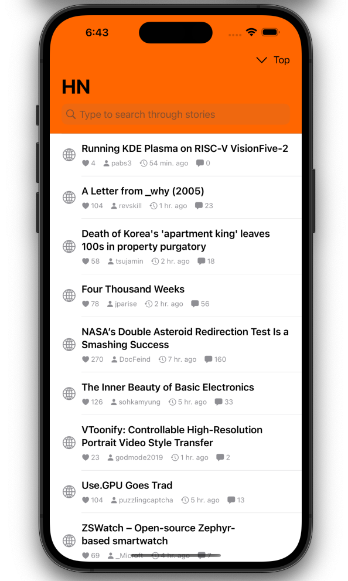
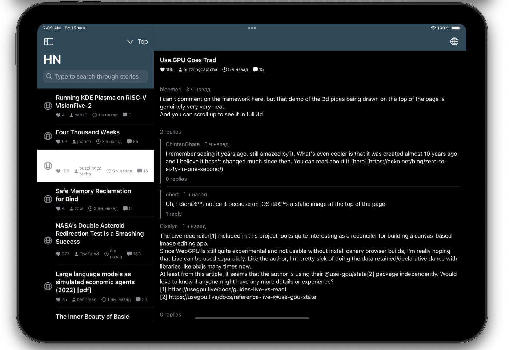

# SimpleHN

This is a simple HackerNews reader iOS app.

    
    

## Motivation

My main goal is to practice Clean Swift (VIP) architecure.
You can read more about it here: https://clean-swift.com

## Technology stack

- SwiftUI
- Swift Concurency (async/await)
- iOS 16 navgiation (NavigationSplitView, NavigationStack)
